# Claude Code 项目管理系统

> **语言版本**: [English](README.md) | [中文](README_ZH.md)

[](https://automaze.io)
 
[](https://github.com/automazeio/ccpm/blob/main/README.md)
[](https://github.com/automazeio/ccpm)
 
[](https://github.com/hesreallyhim/awesome-claude-code?tab=readme-ov-file#general-)
 
[](https://github.com/automazeio/ccpm/blob/main/LICENSE)
 
[](http://x.com/intent/follow?screen_name=aroussi)
 
[](https://github.com/automazeio/ccpm)

### 使用规范驱动开发、GitHub Issues、Git worktrees 和并行运行的多个 AI 代理来交付~~更快~~_更好的_代码的 Claude Code 工作流。

停止丢失上下文。停止任务阻塞。停止交付 bug。这个经过实战验证的系统将 PRD 转化为史诗任务，将史诗任务转化为 GitHub Issues，将 Issues 转化为生产代码——每一步都有完整的可追溯性。


## 目录

- [背景](#背景)
- [工作流程](#工作流程)
- [与众不同之处](#与众不同之处)
- [为什么选择 GitHub Issues？](#为什么选择-github-issues)
- [核心原则：拒绝凭感觉编码](#核心原则拒绝凭感觉编码)
- [系统架构](#系统架构)
- [工作流程阶段](#工作流程阶段)
- [命令参考](#命令参考)
- [并行执行系统](#并行执行系统)
- [核心特性与优势](#核心特性与优势)
- [已验证的成果](#已验证的成果)
- [示例流程](#示例流程)
- [立即开始](#立即开始)
- [本地 vs 远程](#本地-vs-远程)
- [技术说明](#技术说明)
- [支持此项目](#支持此项目)

## 背景

每个团队都在与同样的问题作斗争：
- **上下文在会话间蒸发**，迫使不断重新发现
- **并行工作产生冲突**，当多个开发者接触同一代码时
- **需求漂移**，口头决定覆盖了书面规范
- **进度变得不可见**，直到最后阶段

这个系统解决了所有这些问题。

## 工作流程

```mermaid
graph LR
    A[PRD 创建] --> B[史诗规划]
    B --> C[任务分解]
    C --> D[GitHub 同步]
    D --> E[并行执行]
```



### 60 秒实战演示

```bash
# 通过引导式头脑风暴创建全面的 PRD
/pm:prd-new memory-system

# 将 PRD 转换为技术史诗任务，包含任务分解
/pm:prd-parse memory-system

# 推送到 GitHub 并开始并行执行
/pm:epic-oneshot memory-system
/pm:issue-start 1235
```

## 与众不同之处

| 传统开发方式 | Claude Code PM 系统 |
|------------------------|----------------------|
| 会话间丢失上下文 | **所有工作持久保持上下文** |
| 串行任务执行 | **独立任务的并行代理** |
| 凭记忆"感觉编码" | **规范驱动**，完整可追溯 |
| 进度隐藏在分支中 | **GitHub 中透明的审计轨迹** |
| 手动任务协调 | **智能优先级**，使用 `/pm:next` |

## 为什么选择 GitHub Issues？

大多数 Claude Code 工作流都是孤立运行的——单个开发者在本地环境中与 AI 协作。这创造了一个根本问题：**AI 辅助开发变成了孤岛**。

通过使用 GitHub Issues 作为我们的数据库，我们解锁了强大的能力：

### 🤝 **真正的团队协作**
- 多个 Claude 实例可以同时在同一项目上工作
- 人类开发者通过 Issue 评论实时看到 AI 进度
- 团队成员可以在任何地方加入——上下文始终可见
- 管理者获得透明度而不会打断工作流

### 🔄 **无缝的人机协作交接**
- AI 可以开始任务，人类可以完成它（反之亦然）
- 进度更新对所有人可见，不会被困在聊天记录中
- 代码审查通过 PR 评论自然发生
- 不再有"AI 做了什么？"的会议

### 📈 **超越独立工作的可扩展性**
- 添加团队成员无需入职摩擦
- 多个 AI 代理在不同 Issues 上并行工作
- 分布式团队自动保持同步
- 与现有 GitHub 工作流和工具兼容

### 🎯 **单一真实来源**
- 没有单独的数据库或项目管理工具
- Issue 状态就是项目状态
- 评论是审计轨迹
- 标签提供组织

这不仅仅是一个项目管理系统——这是一个**协作协议**，让人类和 AI 代理能够大规模协作，使用您的团队已经信任的基础设施。

## 核心原则：拒绝凭感觉编码

> **每一行代码都必须能追溯到规范。**

我们遵循严格的 5 阶段纪律：

1. **🧠 头脑风暴** - 思考得比舒适更深入
2. **📝 文档化** - 编写不留任何解释空间的规范
3. **📐 规划** - 明确技术决策的架构设计
4. **⚡ 执行** - 准确构建指定的内容
5. **📊 跟踪** - 在每一步维护透明的进度

没有捷径。没有假设。没有遗憾。

## 系统架构

```
.claude/
├── CLAUDE.md          # 始终在线的指令（将内容复制到项目的 CLAUDE.md 文件中）
├── agents/            # 面向任务的代理（用于上下文保存）
├── commands/          # 命令定义
│   ├── context/       # 创建、更新和初始化上下文
│   ├── pm/            # ← 项目管理命令（此系统）
│   └── testing/       # 初始化和执行测试（编辑此部分）
├── context/           # 项目范围的上下文文件
├── epics/             # ← PM 的本地工作空间（放在 .gitignore 中）
│   └── [epic-name]/   # 史诗任务和相关任务
│       ├── epic.md    # 实施计划
│       ├── [#].md     # 单个任务文件
│       └── updates/   # 工作进行中的更新
├── prds/              # ← PM 的 PRD 文件
├── rules/             # 放置您想要引用的任何规则文件
└── scripts/           # 放置您想要使用的任何脚本文件
```

## 工作流程阶段

### 1. 产品规划阶段

```bash
/pm:prd-new feature-name
```
启动全面的头脑风暴，创建捕获愿景、用户故事、成功标准和约束条件的产品需求文档。

**输出：** `.claude/prds/feature-name.md`

### 2. 实施规划阶段

```bash
/pm:prd-parse feature-name
```
将 PRD 转换为包含架构决策、技术方法和依赖映射的技术实施计划。

**输出：** `.claude/epics/feature-name/epic.md`

### 3. 任务分解阶段

```bash
/pm:epic-decompose feature-name
```
将史诗任务分解为具体的、可执行的任务，包含验收标准、工作量估算和并行化标记。

**输出：** `.claude/epics/feature-name/[task].md`

### 4. GitHub 同步

```bash
/pm:epic-sync feature-name
# 或者对于有信心的工作流：
/pm:epic-oneshot feature-name
```
将史诗任务和任务作为带有适当标签和关系的 Issues 推送到 GitHub。

### 5. 执行阶段

```bash
/pm:issue-start 1234  # 启动专门的代理
/pm:issue-sync 1234   # 推送进度更新
/pm:next             # 获取下一个优先任务
```
专门的代理实施任务，同时维护进度更新和审计轨迹。

## 命令参考

> [!TIP]
> 输入 `/pm:help` 获取简洁的命令摘要

### 初始设置
- `/pm:init` - 安装依赖项并配置 GitHub

### PRD 命令
- `/pm:prd-new` - 为新产品需求启动头脑风暴
- `/pm:prd-parse` - 将 PRD 转换为实施史诗任务
- `/pm:prd-list` - 列出所有 PRD
- `/pm:prd-edit` - 编辑现有 PRD
- `/pm:prd-status` - 显示 PRD 实施状态

### 史诗任务命令
- `/pm:epic-decompose` - 将史诗任务分解为任务文件
- `/pm:epic-sync` - 将史诗任务和任务推送到 GitHub
- `/pm:epic-oneshot` - 一个命令中分解并同步
- `/pm:epic-list` - 列出所有史诗任务
- `/pm:epic-show` - 显示史诗任务及其任务
- `/pm:epic-close` - 标记史诗任务为完成
- `/pm:epic-edit` - 编辑史诗任务详情
- `/pm:epic-refresh` - 从任务更新史诗任务进度

### Issue 命令
- `/pm:issue-show` - 显示 Issue 和子 Issues
- `/pm:issue-status` - 检查 Issue 状态
- `/pm:issue-start` - 使用专门代理开始工作
- `/pm:issue-sync` - 推送更新到 GitHub
- `/pm:issue-close` - 标记 Issue 为完成
- `/pm:issue-reopen` - 重新打开已关闭的 Issue
- `/pm:issue-edit` - 编辑 Issue 详情

### 工作流命令
- `/pm:next` - 显示带史诗任务上下文的下一个优先 Issue
- `/pm:status` - 整体项目仪表板
- `/pm:standup` - 每日站会报告
- `/pm:blocked` - 显示被阻塞的任务
- `/pm:in-progress` - 列出进行中的工作

### 同步命令
- `/pm:sync` - 与 GitHub 的完整双向同步
- `/pm:import` - 导入现有的 GitHub Issues

### 维护命令
- `/pm:validate` - 检查系统完整性
- `/pm:clean` - 归档已完成的工作
- `/pm:search` - 搜索所有内容

## 并行执行系统

### Issues 不是原子的

传统思维：一个 Issue = 一个开发者 = 一个任务

**现实：一个 Issue = 多个并行工作流**

单个"实施用户认证"Issue 不是一个任务。它是...

- **代理 1**：数据库表和迁移
- **代理 2**：服务层和业务逻辑
- **代理 3**：API 端点和中间件
- **代理 4**：UI 组件和表单
- **代理 5**：测试套件和文档

全部在同一个工作树中**同时**运行。

### 速度的数学

**传统方法：**
- 包含 3 个 Issues 的史诗任务
- 顺序执行

**此系统：**
- 包含 3 个 Issues 的相同史诗任务
- 每个 Issue 分解为约 4 个并行流
- **12 个代理同时工作**

我们不是将代理分配给 Issues。我们**利用多个代理**来更快交付。

### 上下文优化

**传统的单线程方法：**
- 主对话承载所有实施细节
- 上下文窗口被数据库模式、API 代码、UI 组件填满
- 最终达到上下文限制并失去连贯性

**并行代理方法：**
- 主线程保持清洁和战略性
- 每个代理在隔离中处理自己的上下文
- 实施细节永远不会污染主对话
- 主线程维护监督而不被代码淹没

您的主对话成为指挥者，而不是乐队。

### GitHub vs 本地：完美分离

**GitHub 看到的：**
- 清洁、简单的 Issues
- 进度更新
- 完成状态

**本地实际发生的：**
- Issue #1234 爆炸为 5 个并行代理
- 代理通过 Git 提交协调
- 复杂的编排隐藏不见

GitHub 不需要知道工作是如何完成的——只需要知道它已经完成。

### 命令流程

```bash
# 分析可以并行化的内容
/pm:issue-analyze 1234

# 启动群体
/pm:epic-start memory-system

# 观看魔法
# 12 个代理在 3 个 Issues 上工作
# 全部在：../epic-memory-system/

# 完成时进行一次清洁合并
/pm:epic-merge memory-system
```

## 核心特性与优势

### 🧠 **上下文保存**
永远不再丢失项目状态。每个史诗任务维护自己的上下文，代理从 `.claude/context/` 读取，并在同步前本地更新。

### ⚡ **并行执行**
通过多个代理同时工作更快交付。标记为 `parallel: true` 的任务启用无冲突的并发开发。

### 🔗 **GitHub 原生**
与您的团队已经使用的工具配合工作。Issues 是真实来源，评论提供历史记录，没有对 Projects API 的依赖。

### 🤖 **代理专业化**
为每个工作选择合适的工具。不同的代理用于 UI、API 和数据库工作。每个都读取需求并自动发布更新。

### 📊 **完整可追溯性**
每个决策都有文档。PRD → 史诗任务 → 任务 → Issue → 代码 → 提交。从想法到生产的完整审计轨迹。

### 🚀 **开发者生产力**
专注于构建，而非管理。智能优先级、自动上下文加载和准备就绪时的增量同步。

## 已验证的成果

使用此系统的团队报告：
- **减少 89% 的时间**损失在上下文切换上——您将大大减少使用 `/compact` 和 `/clear`
- **5-8 个并行任务** vs 之前的 1 个——同时编辑/测试多个文件
- **减少 75% 的 bug 率**——由于将功能分解为详细任务
- **提高最多 3 倍**的功能交付速度——基于功能大小和复杂性

## 示例流程

```bash
# 开始一个新功能
/pm:prd-new memory-system

# 审查和完善 PRD...

# 创建实施计划
/pm:prd-parse memory-system

# 审查史诗任务...

# 分解为任务并推送到 GitHub
/pm:epic-oneshot memory-system
# 创建 Issues：#1234（史诗任务），#1235，#1236（任务）

# 开始开发任务
/pm:issue-start 1235
# 代理开始工作，维护本地进度

# 同步进度到 GitHub
/pm:issue-sync 1235
# 更新作为 Issue 评论发布

# 检查整体状态
/pm:epic-show memory-system
```

## 立即开始

### 快速设置（2 分钟）

1. **将此仓库安装到您的项目中**：

   #### Unix/Linux/macOS

   ```bash
   cd path/to/your/project/
   curl -sSL https://automaze.io/ccpm/install | bash
   # 或：wget -qO- https://automaze.io/ccpm/install | bash
   ```

   #### Windows (PowerShell)
   ```bash
   cd path/to/your/project/
   iwr -useb https://automaze.io/ccpm/install | iex
   ```
   > ⚠️ **重要**：如果您已经有 `.claude` 目录，请将此仓库克隆到不同目录，并将克隆的 `.claude` 目录内容复制到您项目的 `.claude` 目录。

   在[安装指南 ›](https://github.com/automazeio/ccpm/tree/main/install)中查看完整/其他安装选项


2. **初始化 PM 系统**：
   ```bash
   /pm:init
   ```
   此命令将：
   - 安装 GitHub CLI（如果需要）
   - 与 GitHub 认证
   - 安装 [gh-sub-issue 扩展](https://github.com/yahsan2/gh-sub-issue) 用于正确的父子关系
   - 创建必需的目录
   - 更新 .gitignore

3. **创建包含仓库信息的 `CLAUDE.md`**
   ```bash
   /init include rules from .claude/CLAUDE.md
   ```
   > 如果您已经有 `CLAUDE.md` 文件，运行：`/re-init` 来用 `.claude/CLAUDE.md` 中的重要规则更新它。

4. **初始化系统**：
   ```bash
   /context:create
   ```


### 开始您的第一个功能

```bash
/pm:prd-new your-feature-name
```

观看结构化规划转化为已交付的代码。

## 本地 vs 远程

| 操作 | 本地 | GitHub |
|-----------|-------|--------|
| PRD 创建 | ✅ | — |
| 实施规划 | ✅ | — |
| 任务分解 | ✅ | ✅ (同步) |
| 执行 | ✅ | — |
| 状态更新 | ✅ | ✅ (同步) |
| 最终交付物 | — | ✅ |

## 技术说明

### GitHub 集成
- 使用 **gh-sub-issue 扩展** 实现正确的父子关系
- 如果未安装扩展则回退到任务列表
- 史诗任务 Issues 自动跟踪子任务完成情况
- 标签提供额外组织（`epic:feature`，`task:feature`）

### 文件命名约定
- 任务在分解期间从 `001.md`，`002.md` 开始
- GitHub 同步后，重命名为 `{issue-id}.md`（例如，`1234.md`）
- 便于导航：Issue #1234 = 文件 `1234.md`

### 设计决策
- 有意避免 GitHub Projects API 的复杂性
- 所有命令首先在本地文件上操作以提高速度
- 与 GitHub 的同步是明确和受控的
- 工作树为并行工作提供清洁的 git 隔离
- GitHub Projects 可以单独添加用于可视化

---

## 支持此项目

Claude Code PM 由 [Automaze](https://automaze.io) 开发，**为交付代码的开发者，由交付代码的开发者创造**。

如果 Claude Code PM 帮助您的团队交付更好的软件：

- ⭐ **[为此仓库加星](https://github.com/automazeio/ccpm)** 以显示您的支持
- 🐦 **[在 X 上关注 @aroussi](https://x.com/aroussi)** 获取更新和技巧


---

> [!TIP]
> **与 Automaze 一起更快交付。** 我们与创始人合作，将他们的愿景变为现实，扩展业务，并为成功优化。
> **[访问 Automaze 与我预约通话 ›](https://automaze.io)**

---

## Star 历史

